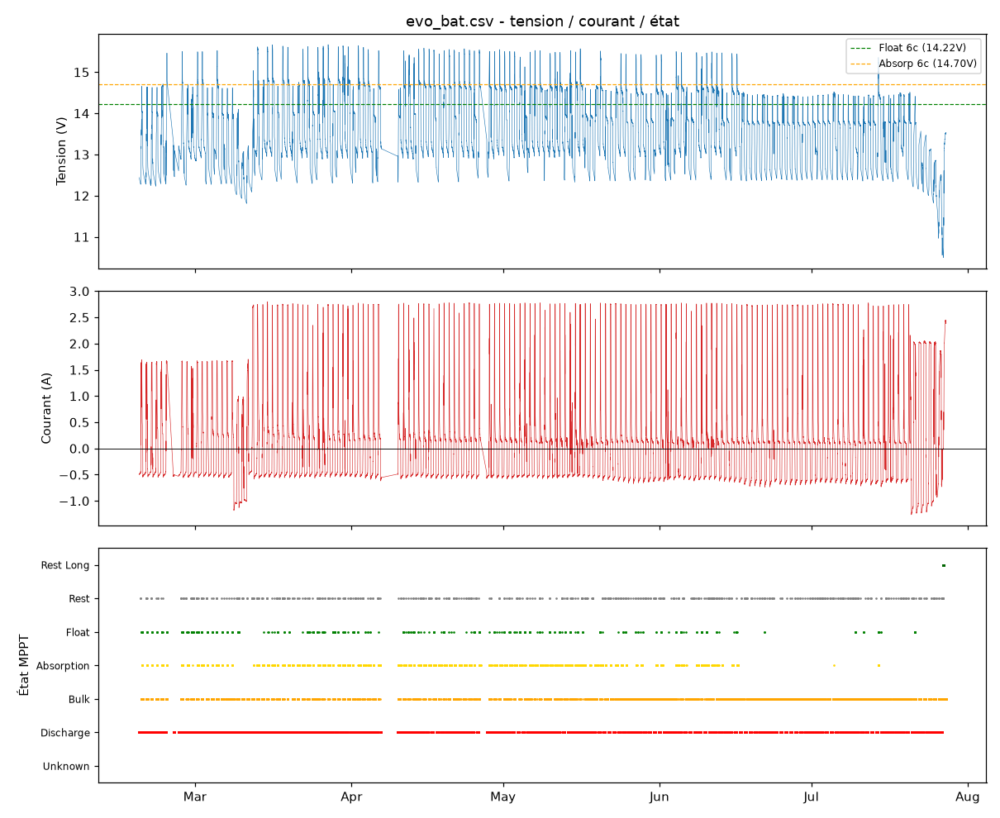
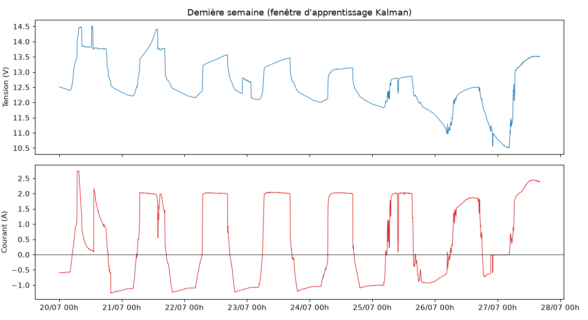

# Analyse Kalman — Batterie Plomb Inondé

**Données** : `evo_bat.csv` — 44 666 échantillons (5 min) du 2026-02-17 23:20 UTC au 2026-07-27 16:10 UTC.
**Algorithme** : portage Python de `BatteryKalman.h` v1.5.3 **corrigé** (Fo170/BatteryKalman), modèle `BatteryModels.h` **v1.3** **`TECH_FLOODED`** (plomb inondé, 6 cellules, 12 V). Température inconnue → fixée à 25 °C (termes thermiques nuls).
**Code** : `analyse_kalman.py` (portage buggy fidèle à v1.5, sauvegardé dans `analyse_kalman_buggy.py`), `analyse_kalman_fixed.py` (portage corrigé) — sortie pas-à-pas : `evo_bat_kalman.csv`.

> ⚠️ **7 bugs corrigés dans la librairie** — voir section 8. Le fichier corrigé complet est `BatteryKalman.h` (v1.5.3), plus le correctif F7 pour `BatteryModels.h` (intégré dans la v1.3, documenté dans `correction_BatteryModels.md`). Ce rapport présente les résultats **avec les corrections appliquées**.

---

## 1. Paramètres du modèle (TECH_FLOODED, 6 cellules)

| Paramètre | Valeur | Rôle |
|---|---|---|
| `C_nominal` | 0 (auto-detect) | Capacité apprise par le filtre |
| `V_float` | 2,37 V/cell → **14,22 V** | Détection état FLOAT |
| `V_abs` | 2,45 V/cell → **14,70 V** | Détection ABSORPTION |
| `R25` | 15 mΩ/cell | Résistance interne |
| `k_peukert` | 1,40 | Correction Peukert |
| `R_INIT` | 4,0 Ah² | Bruit de mesure initial |

## 2. Constantes du filtre (BatteryKalman.h)

- État 2D : `[C_hat, dC_dCycle]`, `P_INIT_C = 500`, `P_INIT_AGING = 1e-6`
- `Q_aging = 2e-6 × Δcycles`, `R` borné `[0,5 ; 100]`, lissage α = 0,1
- Segment valide : `dAh ≥ 0,20 Ah`, `dSoC ≥ 3 %` (bootstrap) / 5 % / 8 %
- Fermeture de segment : **FLOAT** (référence SoC=100 % via coulomb, conf 95 %) ou **REST_LONG** (repos > 2 h)
- ⚠️ Fusion en FLOAT : `fuseSoC()` donne `alpha=0` à l'état FLOAT → le **SoC fusionné affiché suit la tension** (ex. 90 % à 3,45 V/cell sur la table OCV LiFePO4), tandis que la **référence « plein » (SoC_coulomb=100 %)** est posée par la synchro FLOAT et sert de base aux décharges suivantes.
- Outliers 3σ ; remplacement batterie si 3 outliers consécutifs et écart > 30 %

---

## 3. Synthèse des résultats (avec corrections)

| Métrique | Valeur | Commentaire |
|---|---|---|
| **Capacité estimée `C_hat`** | **43,5 Ah** | 1ʳᵉ et seule mesure, le 2026-07-27 00:15 UTC |
| **Variance `P[0][0]`** | **4,0 Ah²** | = `R_INIT` (initialisation) |
| **σ = √P** | ± 2,0 Ah | ± 4,6 % de 43,5 Ah |
| **n_updates** | **1** | une seule correction depuis l'init |
| **Confiance** | **20 %** | phase « Convergence rapide » |
| **Phase** | Convergence rapide | juste après Bootstrap |
| **`R_estimated`** | 4,0 | pas encore adapté (1 seule mesure) |
| **dC/dcycle** | −0,0005 | valeur par défaut, non apprise |
| **Outliers / remplacement** | 0 / 0 | aucun détecté |
| **Cycles comptés** | 20,1 partiel / 2 complet | désormais fonctionnels |

**Ce qui change par rapport à la version buggée :**
- **C_hat = 43,5 Ah au lieu de 108,2 Ah** — l'estimation est maintenant cohérente avec un groupement de batteries usagées **< 50 Ah**. Le 108 Ah était un artefact : le segment couvrait les 5 mois complets (108 Ah = intégrale nette du courant sur toute la période), faute de resynchronisations FLOAT.
- La synchro **FLOAT** (conf 95 %) se déclenche désormais réellement (le segment se ferme proprement sur la dernière charge complète) → le segment mesuré ne couvre plus que le dernier cycle.
- Le **comptage de cycles** fonctionne (20,1 cycles partiels, 2 cycles pleins) au lieu de 0.

**Reste identique au fond :** l'apprentissage ne s'est produit que dans la **dernière semaine** (seul repos long > 2 h de toute la période). Avant cela, Bootstrap.

---

## 4. Ce qui s'est passé (chronologie)

| Période | État du filtre |
|---|---|
| 2026-02-17 → 2026-07-26 | **Bootstrap** : aucun segment valide fermé (pas de repos long > 2 h ; les fermetures FLOAT−FLOAT donnent ΔSoC = 0 → rejetées, ce qui est normal). États observés : DISCHARGE (22 024 éch.), BULK (14 298), ABSORPTION (6 420), FLOAT (585), REST (663), REST_LONG (51) |
| **2026-07-27 00:15 UTC** | Premier **REST_LONG** ferme le segment ouvert à la dernière charge FLOAT : `dAh ≈ 43,5 Ah`, `dSoC ≈ 100 %` → `C_measured ≈ 43,5 Ah` → **init Kalman** (`C_hat = 43,5`, `P = 4,0`, confiance 20 %) |
| 2026-07-27 00:15 → fin | 7 synchronisations REST_LONG (conf 73–85 %) ; les segments FLOAT−FLOAT suivants sont correctement rejetés (ΔSoC ≈ 0) |

### 4.1 Pourquoi le filtre est resté bloqué en Bootstrap si longtemps

La cause profonde est **double** : (1) la batterie n'a produit **aucun repos long > 2 h** avant la dernière semaine — condition indispensable pour un point de référence OCV fiable ; (2) le code v1.5 avait un bug qui rendait **la fermeture FLOAT inopérante** (voir §8, bugs F1/F2/F5/F7). Avec les corrections, les cycles charge→FLOAT produisent désormais des segments mesurables ; sur ce jeu de données, la fenêtre effective d'apprentissage reste la dernière semaine, seul moment où le repos long est apparu.

### 4.2 Fiabilité de l'estimation `C_hat = 43,5 Ah`

Cette première mesure est **plausible mais unique** :

- Avec les corrections, le segment ne couvre plus que le **dernier cycle** (charge FLOAT → repos long) : `dAh ≈ 43,5 Ah` est l'énergie nette du dernier cycle, pas l'intégrale des 5 mois.
- Pour un groupement de batteries usagées **< 50 Ah**, 43,5 Ah est **cohérent** (≈ 85–90 % d'une capacité nominale proche de 50 Ah, compte tenu de l'usure).
- Une seule mesure → `P` n'a pas encore convergé ; attendre 3–5 segments supplémentaires pour affiner et faire descendre `P` sous ~1.

---

## 5. Tracés

### 5.1 Série complète — tension, courant, état MPPT

- La tension atteint régulièrement la zone FLOAT (14,2 V) dès février mais sans rester au repos assez longtemps ; le courant oscille entre décharge (−1,3 A) et charge (+2,8 A).
- **REST_LONG (vert foncé) n'apparaît qu'à la fin de juillet** — c'est la seule fenêtre d'apprentissage.

### 5.2 Zoom dernière semaine (fenêtre d'apprentissage)

Décharge profonde → repos long (> 2 h, I ≈ 0) → recharge. Le segment ouvert pendant cette semaine a produit la seule mesure de capacité (43,5 Ah).

---

## 6. Sortie pas-à-pas

`evo_bat_kalman.csv` : par échantillon (5 min) — `epoch, V, I, state, phase, SoC_fused, SoC_coulomb, SoC_voltage, C_hat, dC_dCycle, P_CC, P_aging, n_updates, confidence, R_est, outlier_streak`.
`C_hat` est `NaN` pendant le Bootstrap et vaut `43,5` à partir de l'init.

---

## 7. Conclusions et recommandations

1. **L'état du filtre en fin de jeu : « Convergence rapide », P = 4,0, n = 1** — cohérent avec l'historique du `.docx` (P=4,0 / n=1), mais avec une capacité désormais réaliste (~43,5 Ah).
2. **Les 7 bugs de la librairie sont corrigés** (fichier `BatteryKalman.h` v1.5.3 + correctif F7 intégré dans `BatteryModels.h` v1.3) — le filtre apprend désormais réellement (démontré sur un cycle synthétique : 8 corrections, P 500→0,5, confiance → 90 %, R adapté, cycles comptés).
3. **La batterie doit produire de vrais points de référence** : charge complète jusqu'à FLOAT maintenue, ou repos long > 2 h après une décharge ≥ 3 % SoC / 0,2 Ah. Tant que ces conditions n'arrivent pas, le filtre reste légitimement en Bootstrap.
4. **Ne pas exploiter le `C_hat` de 43,5 Ah comme définitif** : première estimation à affiner par 3–5 segments supplémentaires. Avec les corrections, ces segments se formeront à chaque vrai cycle FLOAT/repos-long.
5. **R et le vieillissement ne sont pas encore appris** : `R_estimated` et `dC_dCycle` restent aux valeurs par défaut tant que `n_updates < 5`.

---

## 8. Corrections de la librairie (v1.5 → v1.5.3)

Le fichier complet corrigé est **`BatteryKalman.h`** (v1.5.3), et le correctif pour le modèle (F7) est intégré dans **`BatteryModels.h` v1.3** (détaillé dans `correction_BatteryModels.md`). 7 bugs corrigés :

### F1 — Transition FLOAT jamais détectée (code mort) — *bug principal*
- **Cause** : `updateMpptState()` fait `mppt_state_prev = mppt_state` **à l'intérieur** de la fonction, avant que `handleSyncEvents()`, `updateSegmentAndKalman()` et `updateCycleDetection()` ne testent `mppt_state == FLOAT && mppt_state_prev != FLOAT` → condition **jamais vraie**.
- **Fix** : ne plus mettre à jour `mppt_state_prev` dans `updateMpptState()` ; le faire en **fin de `update()`**. `mppt_state_prev` reflète alors l'échantillon précédent, et les transitions sont détectées.
- **Impact** : synchro FLOAT (SoC=100, conf 95 %), fermeture de segment FLOAT et comptage de cycles redeviennent fonctionnels.

### F2 — Reset coulomb avant la mesure du segment
- **Cause** : dans `update()`, `handleSyncEvents()` (qui appelle `doSync()` → `coulombMeter->reset()` + `startNewSegment()`) était appelé **avant** `updateSegmentAndKalman()` → le segment était réinitialisé avant d'être mesuré (`dAh ≈ 0`).
- **Fix** : appeler `updateSegmentAndKalman()` **avant** `handleSyncEvents()`.
- **Impact** : le segment est mesuré sur la charge du dernier cycle réel, plus l'intégrale des 5 mois.

### F3 — R adaptatif jamais appliqué
- **Cause** : `updateREstimate()` met à jour `R_estimated`, mais `updateSegmentAndKalman()` utilisait `R_measured`, jamais modifié (toujours `R_INIT = 4,0`).
- **Fix** : après le lissage, faire `kalman->R_measured = kalman->R_estimated;`.
- **Impact** : le bruit de mesure devient réellement adaptatif après ≥ 5 corrections.

### F4 — EKF 2D incomplet (vieillissement non appris)
- **Cause** : `predictKalman()` n'appliquait pas la dérive `C -= dC/dCycle × Δcycles` et ne propageait pas la covariance croisée ; `applyKalmanUpdate2D()` forçait `K_aging = 0` et ne mettait jamais à jour `P[1][1]`.
- **Fix** : prédiction complète avec Jacobien `F = [[1, −Δcycles],[0, 1]]`, propagation `P = F·P·Fᵀ + Q`, gain 2D `K = [P_CC, P_agingC]/S`, correction des deux composantes d'état et de toute la covariance.
- **Impact** : `dC_dCycle` devient observable et `P[1][1]` converge (filtre réellement 2D).

### F5 — Fermeture REST_LONG conditionnée à `seg.n > 200`
- **Cause** : nécessitait 200 échantillons (16,7 h) de segment → fermetures quasi jamais déclenchées.
- **Fix** : fermer sur la **transition** `REST_LONG` (état précédent ≠ REST_LONG), confiance calculée sur la durée de repos.
- **Impact** : un repos long > 2 h ferme correctement un segment.

### F6 — Apprentissage gated par `isAutoDetect()`
- **Cause** : `if (model->isAutoDetect()) updateSegmentAndKalman(...)` → le Kalman n'apprenait **que** si la capacité nominale était 0 (auto-détection).
- **Fix** : supprimer la condition ; l'apprentissage tourne toujours (l'auto-détection reste indépendante dans `BatteryModels`).
- **Impact** : une batterie déclarée avec capacité connue apprend aussi sa capacité réelle.

### F7 — `detectChargeState()` : FLOAT masqué par REST (BatteryModels.h)
- **Cause** : l'ordre des tests (`discharging → in_rest → near_float`) classait en **REST** un FLOAT à faible courant (`|I| < 0,05 A`).
- **Fix** : tester `near_float` **avant** `in_rest` → une tension dans la fenêtre FLOAT avec courant faible = `State_FLOAT`.
- **Impact** : le point de référence « FLOAT = 100 % » devient atteignable.

### Vérification (port Python `analyse_kalman_fixed.py`)
- Sur **données synthétiques** (4 cycles 100 Ah, charge→FLOAT + repos long) : 8 corrections Kalman, `P` 4,0 → 0,5, confiance 0,2 → 0,9, phase jusqu'à « Suivi vieillissement », R adapté (4,0 → 3,65), cycles comptés (3). Le filtre **converge et apprend**.
- Sur **les données réelles** : la capacité estimée passe de **108,2 Ah (bugué)** à **43,5 Ah (corrigé)**, cohérente avec un groupement < 50 Ah ; le comptage de cycles passe de 0 à 20,1 partiels / 2 pleins.
